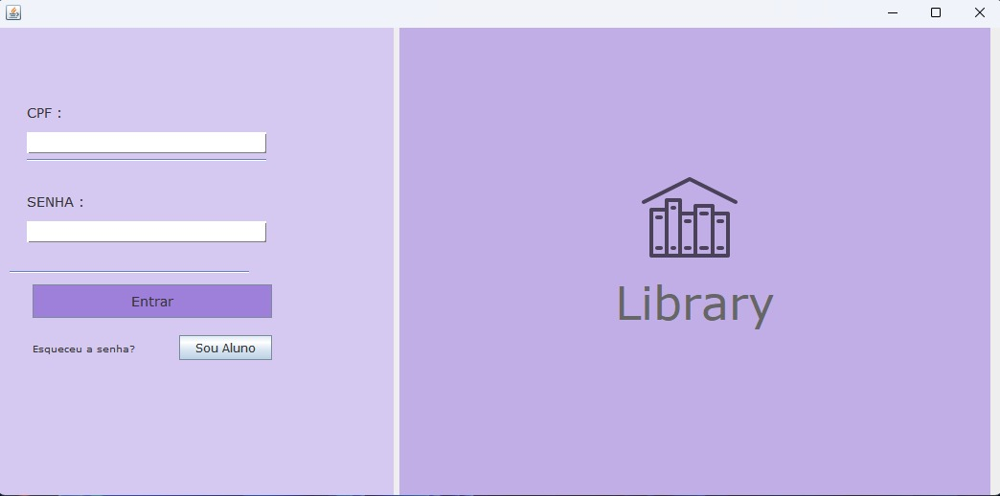
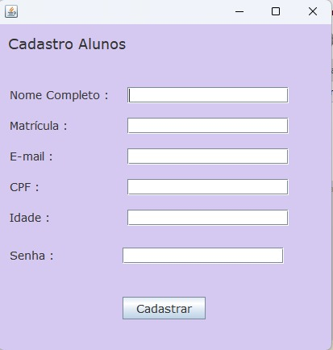
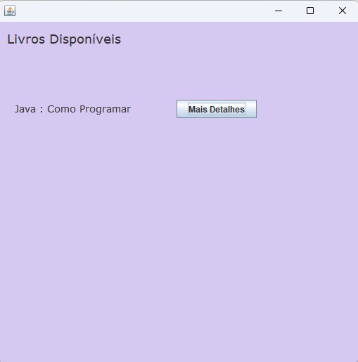
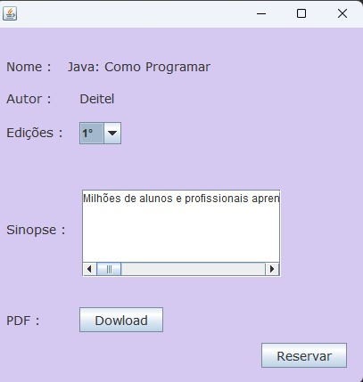
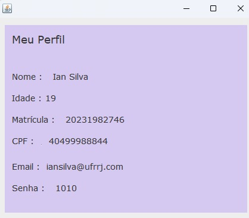

# Sistema de Biblioteca Universitária 📚

Este é um sistema de biblioteca universitária desenvolvido em Java com conexão a um banco de dados MySQL. O sistema possui telas de login com verificação para usuários e bibliotecários, cada um com funcionalidades próprias.
 
## Funcionalidades
 

-**Tela Login:** 
### Bibliotecários 
- **Gerenciar Livros**: Adicionar, editar ou remover livros do catálogo.
- **Gerenciar Usuários**: Adicionar, editar ou remover usuários do sistema.

    
- **Gerenciar Empréstimos**: Visualizar e gerenciar o status de empréstimos e reservas de livros.  
### Usuários
- **Buscar Livros**: Os usuários podem pesquisar por livros no catálogo da biblioteca.   
- **Reservar Livros**: Os usuários podem reservar livros disponíveis. 
   
- **Histórico de Empréstimos**: Os usuários podem visualizar seu histórico de empréstimos.
- **Ver Dados Cadastrais**: Usuários podem ver seus dados cadastrais ao clicar em "meu perfil". 
- **Baixar Livros em PDF**: Se um livro estiver disponível em formato PDF, os usuários podem clicar em um botão para baixar e abrir o livro no seu computador.

## Tecnologias Utilizadas </>
- **Java**: Linguagem de programação principal.
- **MySQL**: Banco de dados relacional.
- **JDBC**: Conexão Java com o banco de dados MySQL.
- **Swing**: Biblioteca gráfica para as interfaces de usuário.
- **AWT (Abstract Window Toolkit)**: Para operações no sistema de arquivos e manipulação de arquivos PDF.

   
